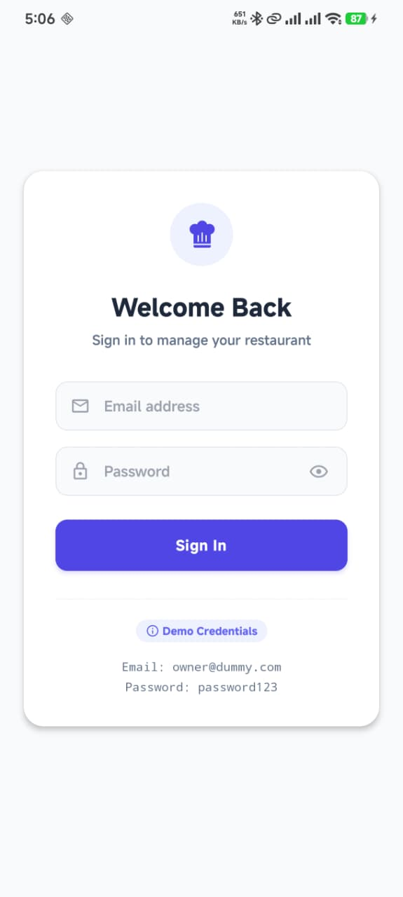
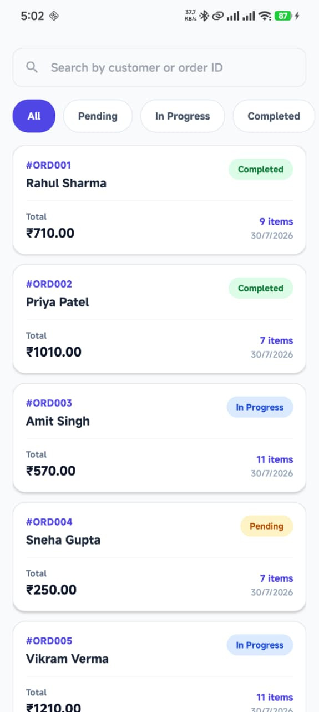
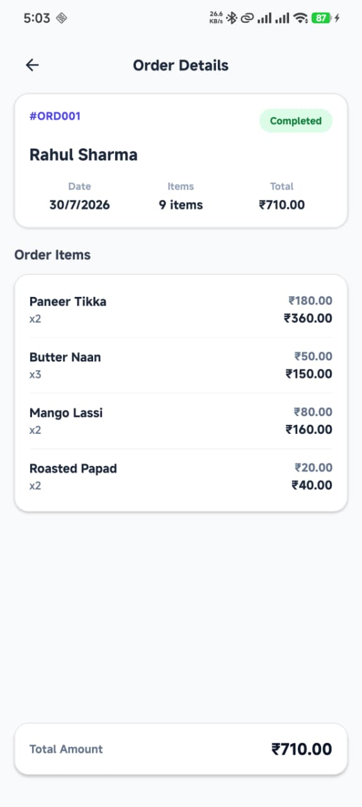
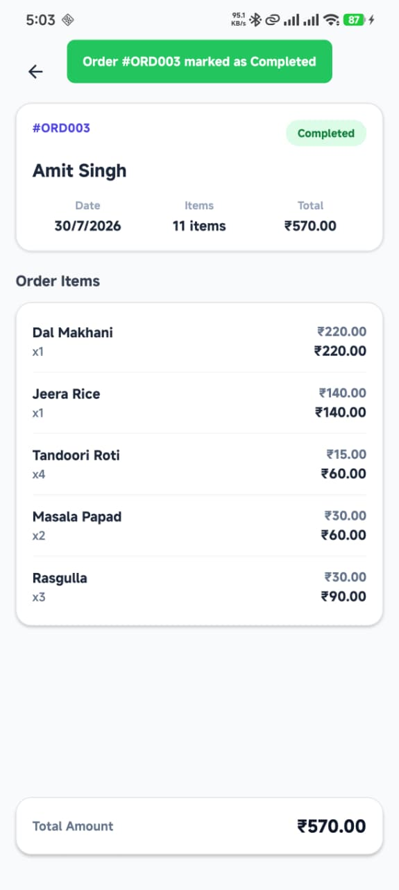
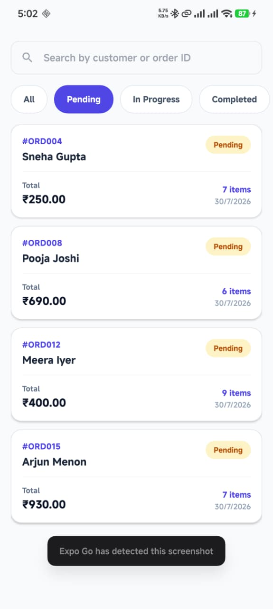
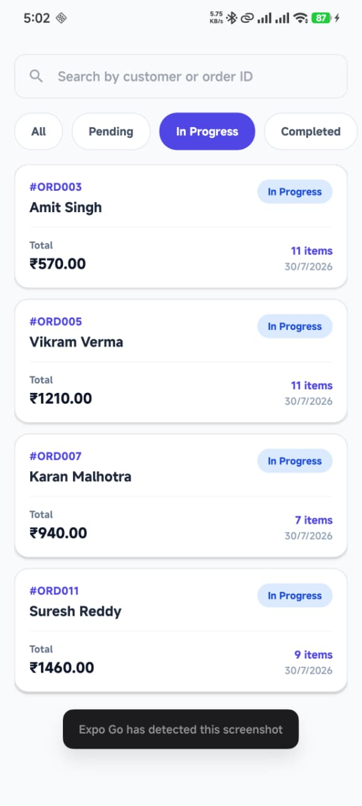
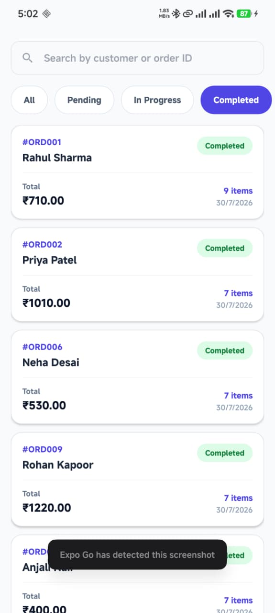

# Restaurant Order Management App

A cross-platform restaurant order management application built with **Expo SDK 54**, **React Native 0.81**, **React 19**, and **TypeScript**. The new architecture is enabled, providing improved performance and developer experience.

---

## Architecture

The app follows a **feature-based modular architecture** with the following structure:

```
src/
├── features/
│   ├── auth/                    # Authentication module
│   │   ├── constants/credentials.ts   # Demo credentials
│   │   └── screens/LoginScreen.tsx    # Login UI
│   └── orders/                  # Orders module
│       ├── components/          # Reusable UI (OrderCard, StatusBadge, SearchBar, StatusFilter)
│       ├── context/orderContext.tsx   # React Context for global orders state
│       ├── data/dummydata.json       # Mock data fallback
│       ├── hooks/useOrder.ts         # Custom hook for orders operations
│       ├── screens/                  # OrdersList, OrderDetails
│       ├── services/orderService.ts  # AsyncStorage persistence layer
│       └── types/order.ts            # TypeScript interfaces & enums
├── navigation/
│   └── AppNavigator.tsx         # React Navigation v7 Native Stack
└── shared/                      # Reserved for cross-cutting utilities
```

### State Management Flow

```
OrdersScreen
     ↓
useOrders()
     ↓
OrdersContext
     ↓
ordersStorage
     ↓
AsyncStorage
```

### Key Architectural Decisions

- **State Management**: React Context API (feature-scoped) — no global state library
- **Persistence**: `@react-native-async-storage/async-storage` for offline data
- **Navigation**: `@react-navigation/native-stack` v7 with typed routes
- **Component Pattern**: Reusable feature-specific components

---

## Getting Started

### Prerequisites

- Node.js (>= 18)
- npm or yarn
- Expo CLI
- For mobile: iOS Simulator (macOS) / Android Emulator
- For web: Modern browser

### Installation

```bash
npm install
```

### Running the App

```bash
# Start the Expo development server
npm start

# Run on iOS simulator
npm run ios

# Run on Android emulator
npm run android

# Run on web browser
npm run web
```

### Demo Credentials

The app uses hardcoded demo credentials for the login screen. Check `src/features/auth/constants/credentials.ts` for the current values.

---

## Screenshots

<table>
  <tr>
    <td></td>
    <td></td>
  </tr>
  <tr>
    <td></td>
    <td></td>
  </tr>
  <tr>
    <td></td>
    <td></td>
  </tr>
  <tr>
    <td></td>
    <td></td>
  </tr>
</table>

---

## Tech Stack

| Package | Version | Purpose |
|---------|---------|---------|
| expo | ~54.0.35 | Framework |
| react-native | 0.81.5 | Core |
| @react-navigation/native | ^7.3.14 | Navigation |
| @react-navigation/native-stack | ^7.18.6 | Stack navigator |
| @react-native-async-storage/async-storage | 2.2.0 | Persistence |
| react-native-toast-message | ^2.4.0 | Toast notifications |
| @expo/vector-icons | ^15.1.1 | Icons |

---

## License

Private
